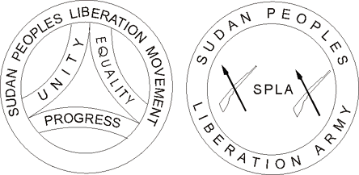

# South Sudan Data

Data about South Sudan armed groups and other organizations

## Armed Groups

### Sudan People's Liberation Movement/Army (SPLM/A)
- [Salva Kiir](https://twitter.com/PresSalva), President
- "King" Paul Malong Awan, Lt. General Chief of Staff
-  Alfred Lado Gore, Minister of Interior

### Sudan People's Liberation Movement/Army in Opposition (SPLM/A-IO)
- [Dr. Riek Machar](https://twitter.com/Drriekmachar), President
- Taban Deng Gai, First Vice President
- Chuol Laam, Spokesperson for the First Vice President
- [James Gatdet Dak](https://twitter.com/JamesGatdetDak), Spokesperson for the First Vice President
- Dr. Dhieu Mathok Ding, Secretary General and Energy Minister

### Federal Democratic Party / South Sudan Armed Forces (FDP/SSAF)
- Gabriel Changson, Former Minister
- Gabriel "Tang-Ginye" Gatwech Chan, General

### Aguelek
- John Olony

### Fertit Opposition

### South Sudan National Liberation Movement (SSNLM)

### Unkown Affiliation

- Cirino Hiteng, Deputy Minister of Foreign Affairs and International Cooperation

---

## Civil Society

### South Sudan Civil Society Alliance (SSCSA)
- Keluel Agok, Former Secretary General (-2017?)[4](#ref4)
- Akuoc Ajang Nyanhom, Chairperson[1](#ref1)

### South Sudan NGO Forum
[Website](http://southsudanngoforum.org/)

### South Sudan United States (SSUS)
- Simon Wuor Tut, Founder

---

## Government

### National
- Salva Kiir, President
- Paulino Wanawila, Minister of Justice[2](#ref2), Chairperson of Judges Committee[2](#ref2)
- Michael Makuei Lueth, Head of Legal Administration[2](#ref2), Deputy of Judges Committee[2](#ref2)
- Majok Mading Majok, Secretary of Judges Committee[2](#ref2)

### Boma State
- John Achuan, Minister of Information[4](#ref3)

---

## National Anthem of South Sudan

Verse 1:

> Oh God,

> We praise and glorify you

> For your grace on South Sudan

> Land of great abundance

> Uphold us united in peace and harmony.

Verse 2:

> Oh motherland

> Arise! Raise your flag with the guiding star

> And sing songs of freedom with joy,

> For justice, liberty and prosperity

> Shall forever more reign.

Verse 3:

> Oh great patriots!

> Let us stand up in silence and respect

> Saluting our martyrs whose blood

> Cemented our national foundation,

> We vow to protect our nation.

> God bless South Sudan.

---

## References
1.  “Civil society group condemns heavy deployment of troops in Juba,” http://radiotamazuj.org/en/news/article/civil-society-group-condemns-heavy-deployment-of-troops-in-juba
2.  “President Kiir forms committee to hold talks with judges,” http://radiotamazuj.org/en/news/article/president-kiir-forms-committee-to-hold-talks-with-judges
3.  “18 displaced people die of hunger in Boma state,” http://radiotamazuj.org/en/news/article/18-displaced-people-die-of-hunger-in-boma-state
4.  “Two Officials of Civil Society Alliance Argue Over Position,” http://www.eyeradio.org/officials-civil-society-alliance-argue-position/
